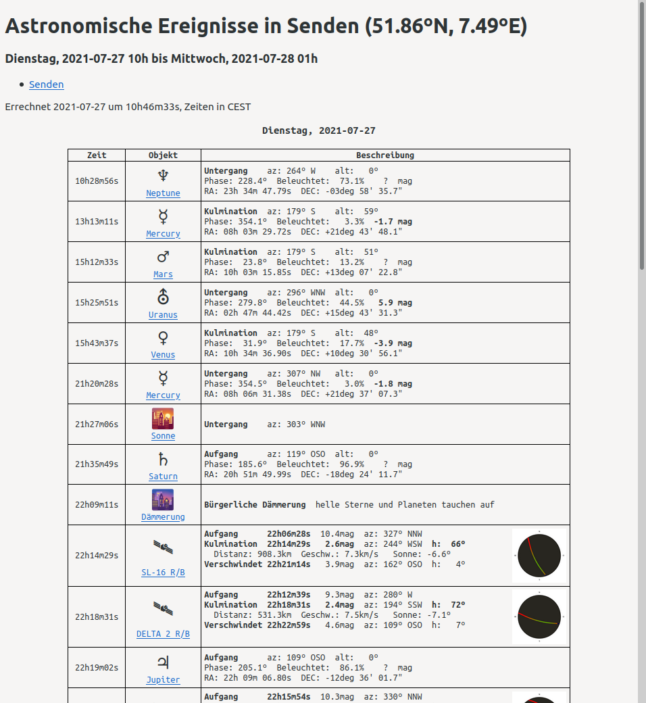

SkyCalc.py
Achtung: Das Skript ist noch nicht fertig. Es kann sich jederzeit die Nuterschnittstelle und der Umfang ändern.

SkyCalc entstand aus dem Mangel einer guten Alternative von Calsky weil jenes seinen Dienst einstellte. Daher habe ich mich optisch auch sehr stark daran orientiert. Die Berechnungen werden durch Pythons Skyfield modul durchgeführt.



Die Links der Satelliten führen auf deren jeweiligen Informationsseiten von heavens-above.com und die Links der Planeten, des Mondes und der Sonne auf deren jeweiligen Informationsseiten von theskylive.com. Das sind einfach nach meiner persönlichen Meinung die besten noch vorhandenden Informationsquellen zu den jeweiligen Objekten.

## Optional:
```bash
chmod +x skycalc.py
```
Dadurch wird die Datei ausführbar und `./skycalc.py` startet das Skript. Anderenfalls muss es jedesmal mit `python skycalc.py` gestartet werden was schlicht unpraktischer ist.

## Konfigurationsdatei
In `.config` im gleichen ordner werden für jeden Ort seine Daten angegeben.Das sind Länge, Breite und Höhe. Für jeden Ort wird in eckigen Klammern sein Name geschrieben und darunter in beliebiger Reihenfolge `lat` (östliche Länge), `lon` (nördliche Breite), `elev` (höhe über NN in Metern) und `sat-m` (Mindesthelligkeit der Satelliten). Werden mehrere Orte angegeben werden auch immer alle berechnet! Das kann gerade bei aktiver Satellitenberechnung länger dauern.
### Beispiel:
```
[Ulm]
lon = 9.98
lat = 48.37
elev = 478
sat-m = 3.5
```
Letztlich entsteht im Unterordner `html` für jeden Ort eine Datei mit seinem Namen, und sie sind  mit einander verlinkt.

## Nutzerschnittstelle
Ohne Parameter erzeugt es die Tabelle in [Name des Ortes].html im Unterordner `html`. Bei mehreren Orten in der .config werden also mehrere Html-Dokumente im Ordner liegen und jene miteinander verlinkt.

### Parameter -start [%Y-%m-%d-%H]
`./skycalc.py -start 2021-01-05-00` setzt den Starttermin auf den fünften Januar 2021. Standartmäßig ist es der Zeitpunkt der Beginn der angefangenden Stunde. Die Stunde muss zwingend auch angegeben werden.

### Parameter -dur [int]
`./skycalc.py -dur 48` gibt die Anzahl der Stunden zu 48 an, bis zu der in Zukunft gerechnet wird. Standartmäßig sind es 24.

### Parameter -sat
`./skycalc.py -sat` aktiviert die Berechnung und Anzeige von Satellitenüberflügen. Standartmäßig ist das deaktiviert.

### Parameter -ort
``./skycalc.py -ort Brüssel`` berechnet _nur_ die Tabelle für Brüssel, auch wenn im .config mehrere Orte angegeben wurden. Normalerweise werden alle Orte erstellt.

### Parameter -tb
`./skycalc.py -tb` aktiviert die Erzeugung und Anzeige der Tagebogendiagramme.
