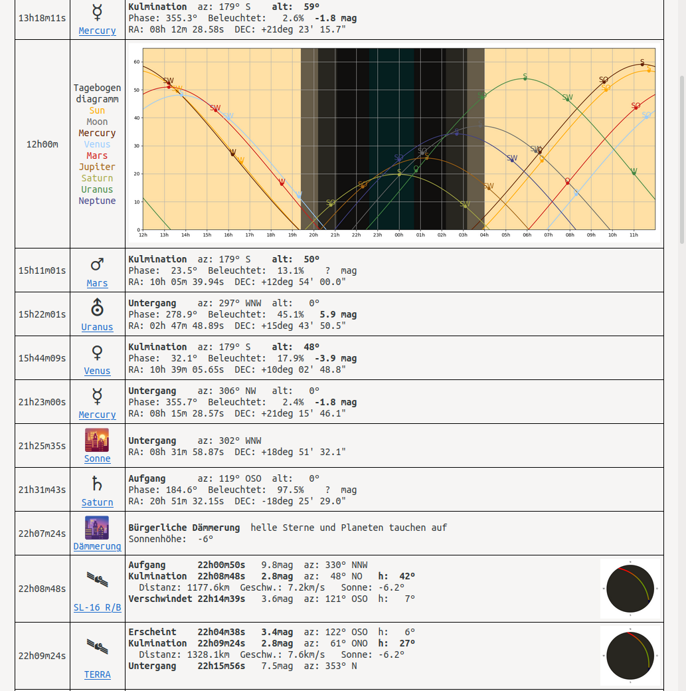

# SkyCalc.py
Achtung: Das Skript ist noch nicht fertig. Es kann sich jederzeit die Nuterschnittstelle und der Umfang ändern.

SkyCalc entstand aus dem Mangel einer guten Alternative von Calsky als jenes seinen Dienst einstellte. Daher habe ich mich optisch auch sehr stark daran orientiert. Die Berechnungen werden durch Pythons Skyfield modul durchgeführt.


*(Die rosa färbung kommt von meiner Browser-Konfiguration. Das ist eine einfache Tabelle ohne farbigen Hintergrund.)*

Die Links der Satelliten führen auf deren jeweiligen Informationsseiten von heavens-above.com und die Links der Planeten, des Mondes und der Sonne auf deren jeweiligen Informationsseiten von theskylive.com. Das sind einfach nach meiner persönlichen Meinung die besten noch vorhandenden Informationsquellen zu den jeweiligen Objekten.

## Optional:
```bash
chmod +x skycalc.py
```
Dadurch wird die Datei ausführbar und ```./skycalc.py``` startet das Skript. Anderenfalls muss es jedesmal mit ```python skycalc.py``` gestartet werden was schlicht unpraktischer ist.

## Zwingende Konfiguration
Oben im Dokument werden einige Variablen gesetzt. Die Kommentare beschreiben wie sie geändert werden ekönnen.

### Variable PATH
Das Skript **muss** wissen, wo es sich befindet um seine Dateien zu schreiben und zu lesen. Bitte ohne abschließenden Slash

### Variable TZ
Das definiert die Zeitzone, in der man lebt. Logischerweise **soll** diese stimmen wenn man nicht zufällig in deutscher Sommerzeit lebt. Im Timedelta wird die differenz zur UTC angegeben, bei Mitteleuropäischer Sommerzeit sind es z.B. 2 Stunden also steht dort [...]hours = 2[...]

## Optionale Konfiguration

### Variable BROWSER
Das definiert welcher Browser zum öffnen der Tabelle verwendet wird. Natürlich kann man sich auch einfach ein Lesezeichen anlegen und dieses nach dem Durchlauf des Skriptes öffnen

## Nutzerschnittstelle
Ohne Parameter erzeugt es die Tabelle in ```table.html``` im gleichen Ordner in dem es sich befindet.

### Parameter -start [%Y-%m-%d-%H]
`./skycalc.py -start 2021-01-05-00` setzt den Starttermin auf den fünften Januar 2021. Standartmäßig ist es der Zeitpunkt heute, 0 Uhr. Die Stunde muss zwingend auch angegeben werden.

### Parameter -dur [int]
`./skycalc.py -dur 48` gibt die Anzahl der Stunden zu 48 an, bis zu der in Zukunft gerechnet wird. Standartmäßig sind es 24.

### Parameter -sat
`./skycalc.py -sat` aktiviert die Berechnung und Anzeige von Satellitenüberflügen. Standartmäßig ist es deaktiviert

### Parameter -sat-mag [float]
`./skycalc.py -sat-mag 4` aktiviert die Berechnung und Anzeige von Satellitenüberflügen UND setzt die Helligkeit nach der gefiltert wird auf 4 magnituden. Satelliten, die während des Überfluges immer dunkler sind werden also nicht geplottet und nicht dargestellt. Standartmäßig ist diese Grenze bei 5.

### Parameter -open
``./skycalc.py -open`` öffnet die Tabelle nach dem Erstellen im angegebenen Browser.

